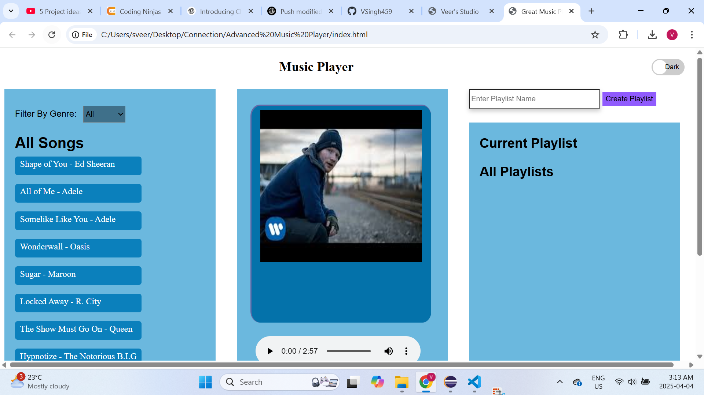

# 🎶 Advanced Music Player (Frontend Only)

A fully interactive music player built using **HTML**, **CSS**, and **JavaScript**. This project lets users explore songs by genre, view and switch between tracks, create playlists, and toggle between light/dark themes — all handled on the frontend.

---

## 🖼️ Preview

👉 [Click here to download the screenshot](Screenshot.png)

---

## 🚀 Features

- 🎵 Browse and filter songs by genre (Rock, Pop, Hip Hop)
- 🖼️ View song details (image, name, artist)
- ⏮️⏭️ Navigate between songs
- ➕ Add songs to custom playlists
- ➕ Create and view your own playlists
- 🌗 Toggle between light and dark mode
- ▶️ Built-in audio player (HTML5 `<audio>`)

---

## 🛠️ Built With

- HTML5
- CSS3
- JavaScript (Vanilla)
- Font Awesome & Google Icons

---

## 💡 Notes

- This is a **frontend-only project** (no backend or external APIs)
- Music files are assumed to exist in a local `/Voice/` folder (e.g., `Voice/baby.mp3`)
- Built as part of my frontend learning journey with a focus on DOM manipulation and UI logic

---

## 🪪 License

MIT License — free to use, improve, and share.
